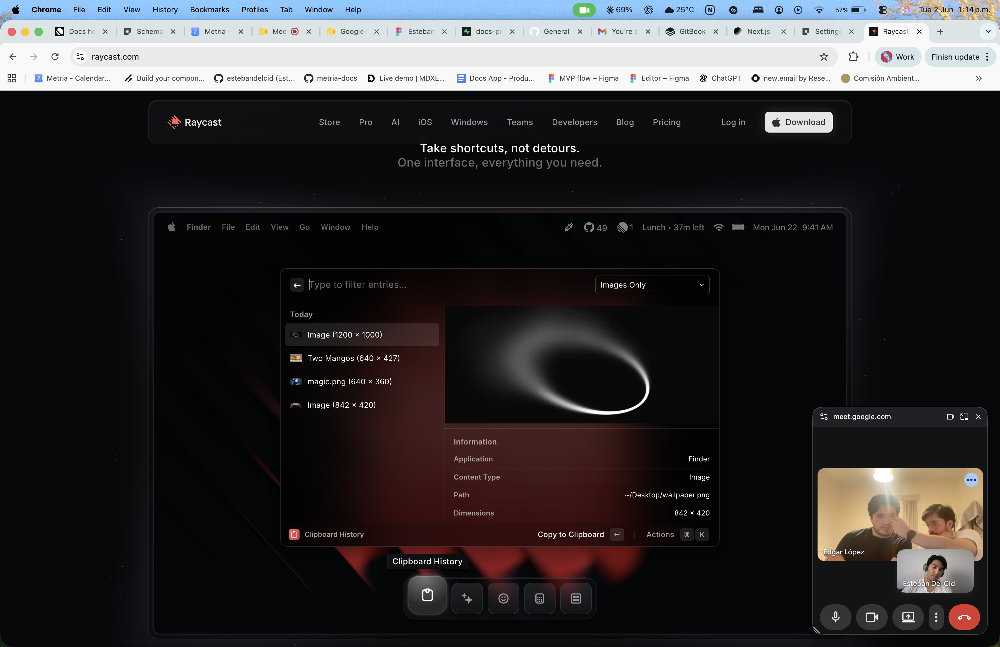

## Setting up

The first step to world-class documentation is setting up your editing environments.

<CardGroup cols="2">
  <Card title="Edit Your Docs" href="https://mintlify.com/docs/quickstart" cta="" icon="pen-to-square" iconColor="gray">
    Get your docs set up locally for easy development
  </Card>

  <Card title="Preview Changes" href="https://mintlify.com/docs/development" cta="" icon="image" iconColor="gray">
    Preview your changes before you push to make sure they're perfect
  </Card>
</CardGroup>

## Make it yours

Update your docs to your brand and add valuable content for the best user conversion.

<CardGroup cols="2">
  <Card title="Customize Style" href="https://mintlify.com/docs/settings/global" cta="" icon="palette" iconColor="gray">
    Customize your docs to your company's colors and brands
  </Card>

  <Card title="Reference APIs" href="https://mintlify.com/docs/api-playground/openapi" cta="" icon="code" iconColor="gray">
    Automatically generate endpoints from an OpenAPI spec
  </Card>

  <Card title="Add Components" href="https://mintlify.com/docs/content/components/accordions" cta="" icon="screwdriver-wrench" iconColor="gray">
    Build interactive features and designs to guide your users
  </Card>

  <Card title="Get Inspiration" href="https://mintlify.com/customers" cta="" icon="stars" iconColor="gray">
    Check out our showcase of our favorite documentation
  </Card>
</CardGroup>